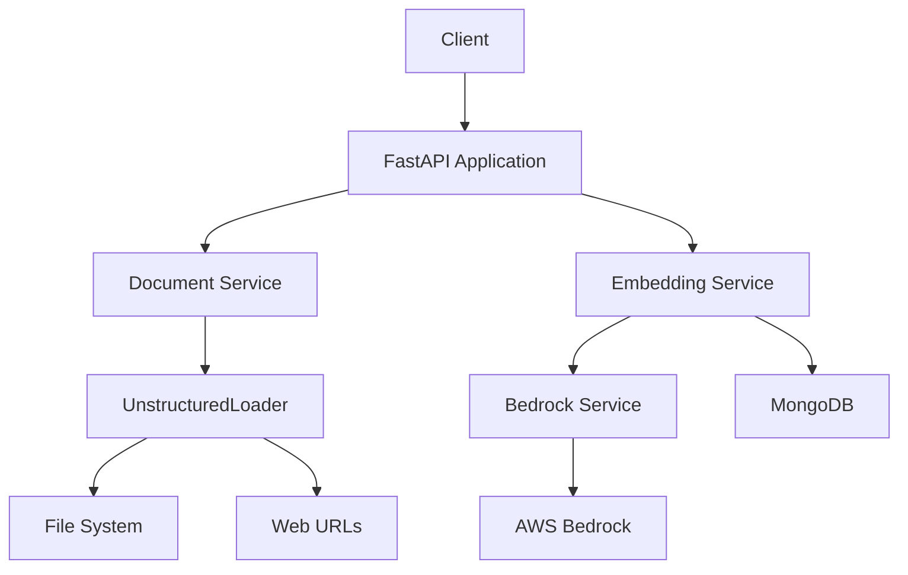

# Data-Loader Documentation

## Table of Contents
1. [Overview](#1-overview)
2. [System Architecture](#2-system-architecture)
3. [Components](#3-components)
4. [Installation & Deployment](#4-installation--deployment)
5. [Configuration](#5-configuration)
6. [Usage](#6-usage)
7. [API Reference](#7-api-reference)
8. [Security Considerations](#8-security-considerations)
9. [Monitoring & Logging](#9-monitoring--logging)
10. [Troubleshooting](#10-troubleshooting)
11. [Development Guide](#11-development-guide)
12. [Maintenance & Operations](#12-maintenance--operations)

### 1. Overview

Data-Loader is a data loading and processing system designed for the MongoDB AI Applications Program. It provides functionality to upload, process, and store documents from various sources, including files and web URLs. The system generates embeddings for the processed documents using AWS Bedrock and stores them in MongoDB for efficient vector search capabilities.

Key features:
- File and web URL processing
- Document chunking and cleaning
- Embedding generation using AWS Bedrock
- MongoDB storage with vector search indexing
- Asynchronous processing for improved performance
- Configurable logging and error handling

### 2. System Architecture



The Data-Loader system consists of several interconnected components that work together to process and store documents with their embeddings.

### 3. Components

1. **FastAPI Application**
   - Purpose: Provides the main API interface for the system
   - Technologies: FastAPI, Python
   - Interactions: Receives requests from clients and coordinates other components

2. **Document Service**
   - Purpose: Processes files and web URLs to extract text and metadata
   - Technologies: UnstructuredLoader, Python
   - Interactions: Communicates with File System and Web URLs

3. **Embedding Service**
   - Purpose: Coordinates document processing and storage
   - Technologies: Python
   - Interactions: Communicates with Document Service, Bedrock Service, and MongoDB

4. **Bedrock Service**
   - Purpose: Generates embeddings for processed documents
   - Technologies: AWS Bedrock, boto3
   - Interactions: Communicates with AWS Bedrock API

5. **MongoDB**
   - Purpose: Stores processed documents and their embeddings
   - Technologies: MongoDB, pymongo
   - Interactions: Stores and retrieves data for the application

### 4. Installation & Deployment

Prerequisites:
- Python 3.7+
- Docker (optional)
- AWS account with Bedrock access
- MongoDB instance

Steps:
1. Clone the repository:
   ```
   git clone https://github.com/mohammaddaoudfarooqi/Data-Loader.git
   cd Data-Loader
   ```

2. Install dependencies:
   ```
   pip install -r requirements.txt
   ```

3. Set up environment variables (see Configuration section)

4. Run the application:
   ```
   python main.py
   ```

For Docker deployment:
1. Build the Docker image:
   ```
   docker build -t Data-Loader .
   ```

2. Run the container:
   ```
   docker run -p 8184:8184 -e AWS_ACCESS_KEY_ID=your_key -e AWS_SECRET_ACCESS_KEY=your_secret Data-Loader
   ```

### 5. Configuration

Configuration is managed through environment variables and the `config.py` file. Key settings include:

- `DEBUG`: Enable debug mode (default: False)
- `SERVICE_HOST`: Host to bind the service (default: 0.0.0.0)
- `SERVICE_PORT`: Port to run the service (default: 8184)
- `AWS_REGION`: AWS region for Bedrock (default: us-east-1)
- `EMBEDDING_MODEL_ID`: Bedrock embedding model ID (default: amazon.titan-embed-text-v1)
- `UPLOAD_DIR`: Directory for uploaded files (default: ./files)
- `MAX_DOCUMENT_CHARACTERS`: Maximum characters per document chunk (default: 10000)
- `MONGODB_CONNECTION_TIMEOUT`: MongoDB connection timeout in ms (default: 5000)
- `VECTOR_DIMENSION`: Embedding vector dimension (default: 1536)

Example `.env` file:
```
DEBUG=false
SERVICE_HOST=0.0.0.0
SERVICE_PORT=8184
AWS_REGION=us-east-1
AWS_ACCESS_KEY_ID=your_access_key
AWS_SECRET_ACCESS_KEY=your_secret_key
EMBEDDING_MODEL_ID=amazon.titan-embed-text-v1
UPLOAD_DIR=uploaded_files
MAX_DOCUMENT_CHARACTERS=10000
MONGODB_CONNECTION_TIMEOUT=5000
VECTOR_DIMENSION=1536
```

### 6. Usage

To use the Data-Loader system:

1. Ensure the service is running (see Installation & Deployment)
2. Send a POST request to the `/upload` endpoint with:
   - Files to process (multipart/form-data)
   - JSON input parameters including:
     - `user_id`: ID of the user
     - `mongodb_config`: MongoDB connection configuration
     - `web_pages`: List of web URLs to process (optional)

Example cURL request:
```
curl -X POST "http://localhost:8184/upload" \
     -H "Content-Type: multipart/form-data" \
     -F "files=@document1.pdf" \
     -F "files=@document2.txt" \
     -F "json_input_params={\"user_id\":\"user123\",\"mongodb_config\":{\"uri\":\"mongodb://localhost:27017\",\"database\":\"maap_db\",\"collection\":\"documents\",\"index_name\":\"vector_index\"},\"web_pages\":[\"https://example.com\"]}"
```

### 7. API Reference

#### POST /upload
Upload and process documents

Request body:
- `files`: List of files to upload (multipart/form-data)
- `json_input_params`: JSON string containing:
  - `user_id`: User ID (string, required)
  - `mongodb_config`: MongoDB configuration (object, required)
    - `uri`: MongoDB connection URI (string, required)
    - `database`: Database name (string, required)
    - `collection`: Collection name (string, required)
    - `index_name`: Vector index name (string, required)
    - `text_field`: Field name for document text (string, default: "text")
    - `embedding_field`: Field name for embeddings (string, default: "embedding")
  - `web_pages`: List of web URLs to process (array of strings, optional)

Response:
- `success`: Boolean indicating operation success
- `message`: Operation result message
- `details`: Additional details about the operation

### 8. Security Considerations

- Use HTTPS for all API communications
- Secure MongoDB connection with authentication and TLS
- Implement proper access controls for AWS credentials
- Sanitize and validate all user inputs
- Regularly update dependencies and apply security patches
- Implement rate limiting to prevent abuse

### 9. Monitoring & Logging

The system uses a custom `MaapLogger` for comprehensive logging:

- Logs are sent to both local files and a remote logging service
- Log levels: DEBUG, INFO, WARNING, ERROR, CRITICAL
- Logs include contextual information and structured metadata
- Logs are stored in the `logs` directory with a configurable retention period

To monitor the system:
- Check application logs for errors and performance issues
- Monitor MongoDB performance and disk usage
- Set up AWS CloudWatch alarms for Bedrock API usage and errors

### 10. Troubleshooting

Common issues and solutions:
- Connection errors: Check network connectivity and MongoDB configuration
- AWS authentication errors: Verify AWS credentials and permissions
- File processing errors: Ensure file formats are supported and not corrupted
- Performance issues: Monitor resource usage and consider scaling infrastructure

For detailed error information, check the application logs and enable DEBUG mode if necessary.

### 11. Development Guide

Project structure:
- `main.py`: FastAPI application entry point
- `config.py`: Configuration settings
- `database/`: MongoDB interaction
- `models/`: Pydantic data models
- `services/`: Core business logic
- `utils/`: Utility functions and logging

Development workflow:
1. Set up a local development environment with required dependencies
2. Use `sample.env` as a template for local configuration
3. Implement new features or bug fixes in the appropriate modules
4. Write unit tests for new functionality
5. Run tests and ensure all pass before committing changes
6. Follow PEP 8 style guidelines for Python code

### 12. Maintenance & Operations

Regular maintenance tasks:
- Monitor and rotate log files
- Update dependencies regularly
- Backup MongoDB data
- Monitor AWS Bedrock usage and costs
- Perform regular security audits

Scaling considerations:
- Implement load balancing for increased traffic
- Use MongoDB sharding for large datasets
- Consider using a message queue for asynchronous processing of large batches of documents

By following this documentation, users and developers should be able to effectively deploy, use, and maintain the Data-Loader system.